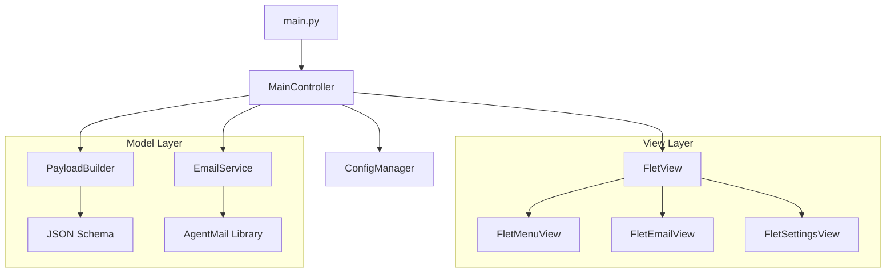
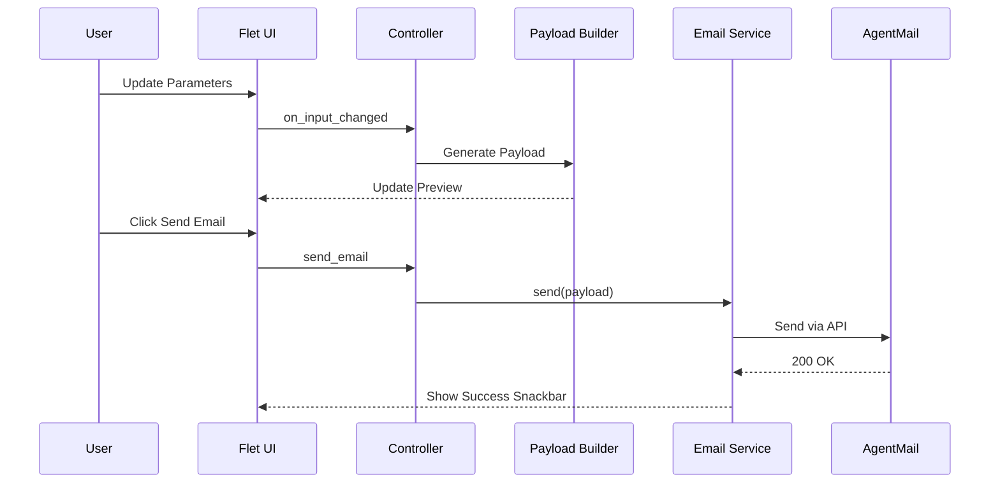

# AFS Validator 🚀

A modern, desktop-based utility designed to validate and send **Trustpilot Automatic Feedback Service (AFS)** invitations. Built with **Python** and **Flet**, it provides a premium, GitHub-inspired interface for managing email payloads and testing AgentMail integrations.

## 🌟 Key Features

- **GitHub Dark Theme**: A sleek, modern UI designed for high readability.
- **Real-time Preview**: Instantly see your HTML/JSON payload as you adjust parameters.
- **JSON Validator**: Integrated 2-column validator to check payloads against official Trustpilot schemas.
- **AgentMail Integration**: Send test invitations directly from the app using the AgentMail API.
- **Flexible Modes**: Support for both "Send AFS Direct" and standard BCC-based invitations.
- **Dynamic Parameters**: Easily toggle and edit invitation details (Template IDs, Locales, SKUs, etc.).

---

## 🛠️ Installation & Setup

This project uses [uv](https://github.com/astral-sh/uv) for high-performance dependency management.

### 1. Prerequisites
- Python 3.12+
- `uv` installed on your system.

### 2. Clone and Setup
```bash
git clone <repository-url>
cd AFS
uv sync
```

### 3. Configuration
Copy the example configuration to create your local `config.toml`:
```bash
cp config.example.toml config.toml
```
Edit `config.toml` to include your:
- `agentmail_api_key`
- `agentmail_inbox_id` (e.g., `your-inbox@agentmail.to`)

---

## 🚀 Running the App

Launch the application using `uv`:
```bash
uv run main.py
```

---

## 📖 How to Use

### 1. Left Panel: Email Settings
- **AFS Email**: The Trustpilot AFS address for your account.
- **Invitation Type**: Select between Service, Product, or SKU-based reviews.
- **To/BCC Status**: Real-time feedback on where the email is being sent based on your "Direct" settings.

### 2. Center Panel: Payload Preview
- View the generated HTML and JSON script tag that will be sent to AFS.

### 3. Right Panel: Parameters
- Toggle specific JSON fields (like `locationId`, `productSkus`, or `tags`).
- Edit values; the preview updates automatically.

### 4. Action Buttons
- **Validate JSON**: Opens a specialized window to paste and validate any JSON snippet.
- **Settings**: Configure your AgentMail credentials and global toggles (Send Direct, Random Ref).
- **Send Email**: Triggers the actual email send via AgentMail.

---

## 🏗️ Architecture



---

## 🔄 Workflow



---

## 📝 License

Distributed under the MIT License. See `LICENSE` for more information.
